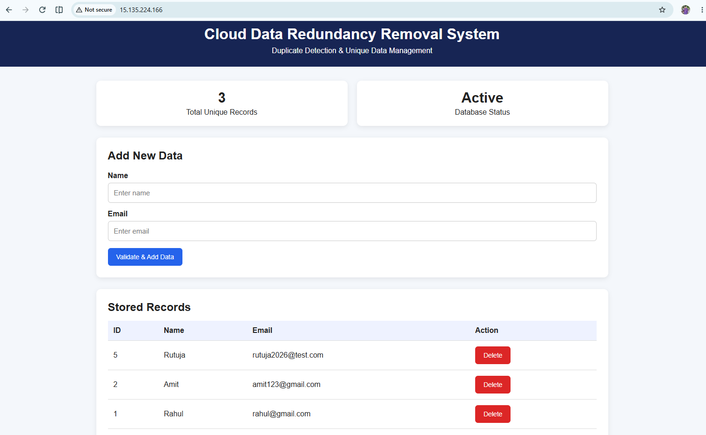
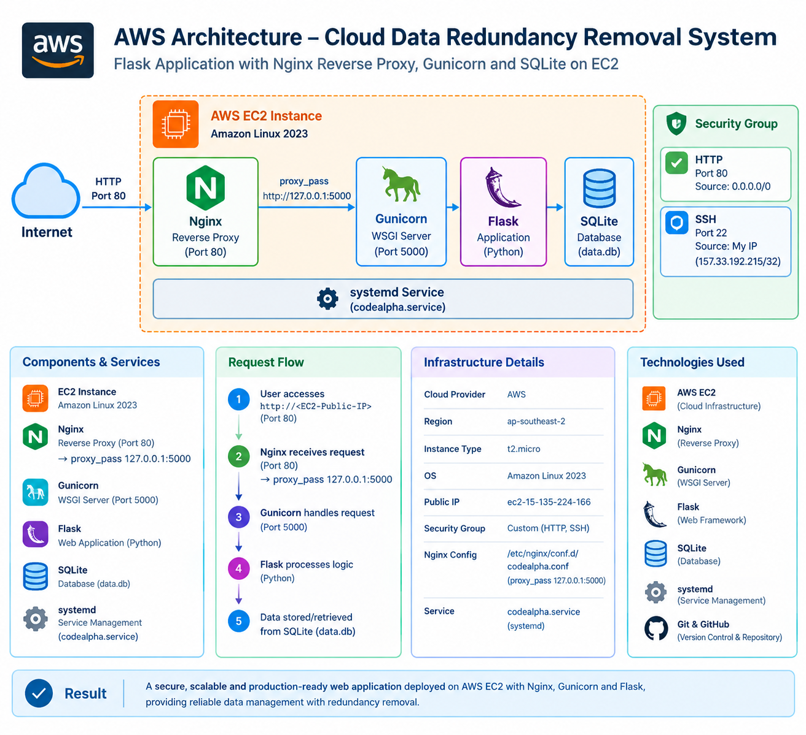

\# Cloud Data Redundancy Removal System


A cloud-based web application for managing user data and reducing redundant records through duplicate email validation and centralized database management.


The application is built using Flask and SQLite and deployed on an AWS EC2 instance using Gunicorn and Nginx.


\---


\## 🚀 Project Overview


The Cloud Data Redundancy Removal System is designed to maintain unique user records by validating email addresses before storing new data.


The application provides a simple web interface where users can:


\- Add new records

\- Validate duplicate email addresses

\- View stored records

\- Track total unique records

\- Delete existing records

\- Manage data through a centralized SQLite database


\---


\## 🎯 Problem Statement


Duplicate data can increase storage usage, reduce data quality and make database management more difficult.


This project provides a simple solution that validates user information before inserting records into the database and prevents duplicate email entries.


\---


\## ✨ Features


\- Duplicate email detection

\- Unique record management

\- Add new user records

\- Delete existing records

\- Total unique record counter

\- SQLite database integration

\- Flask web application

\- AWS EC2 deployment

\- Gunicorn WSGI server

\- Nginx reverse proxy

\- Linux server environment

\- Systemd service for application management


\---


\## 🏗️ Technology Stack


\### Application


\- Python

\- Flask

\- SQLite

\- HTML

\- CSS


\### Cloud \& Infrastructure


\- Amazon EC2

\- Amazon Linux 2023

\- Nginx

\- Gunicorn

\- systemd


\### Development \& Version Control


\- Git

\- GitHub

\- Windows PowerShell

\- Linux Terminal


\---


\## ☁️ AWS Deployment Architecture


```text

&#x20;                   Internet

&#x20;                      |

&#x20;                      v

&#x20;             Public EC2 IP Address

&#x20;                      |

&#x20;                      v

&#x20;                 AWS EC2

&#x20;             Amazon Linux 2023

&#x20;                      |

&#x20;                      v

&#x20;                   Nginx

&#x20;               Reverse Proxy

&#x20;                      |

&#x20;                      v

&#x20;                 Gunicorn

&#x20;                      |

&#x20;                      v

&#x20;                Flask App

&#x20;                      |

&#x20;                      v

&#x20;                SQLite Database

&#x20;                   data.db

---

## 📸 Application Screenshot

The following screenshot shows the deployed Cloud Data Redundancy Removal System running on AWS EC2.



---

### Architecture Diagram

The following diagram represents the deployed AWS infrastructure and application request flow.

